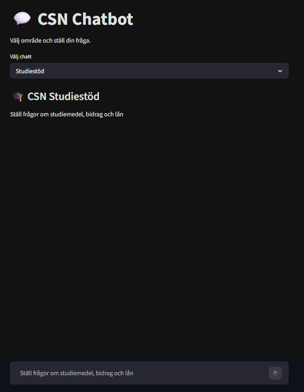
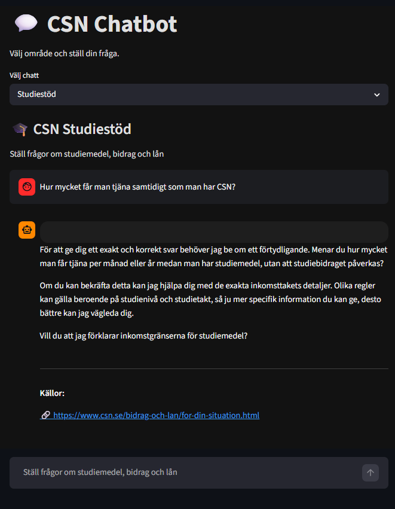
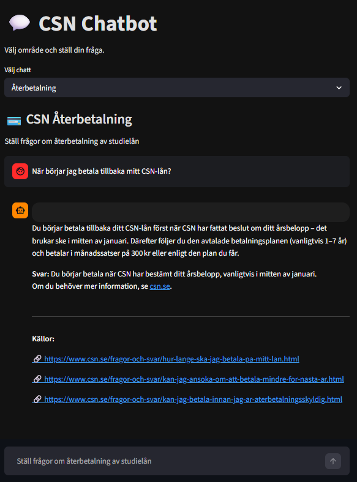
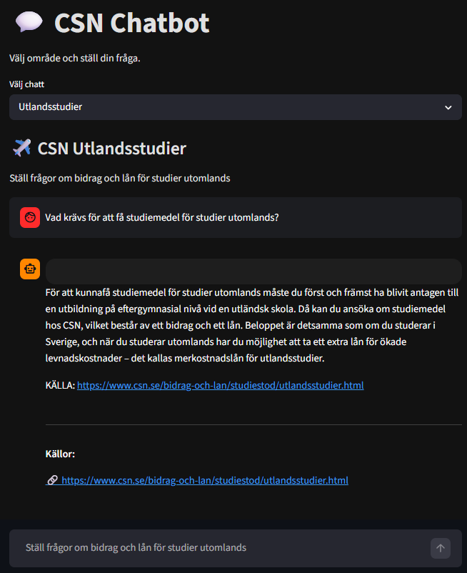
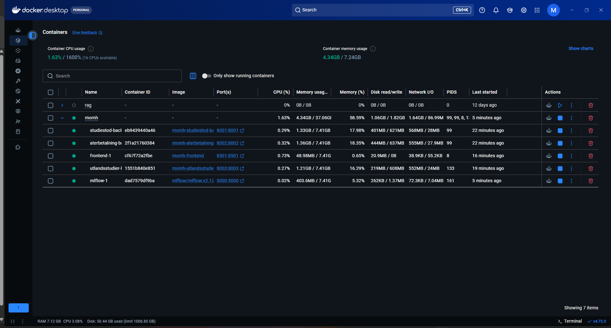
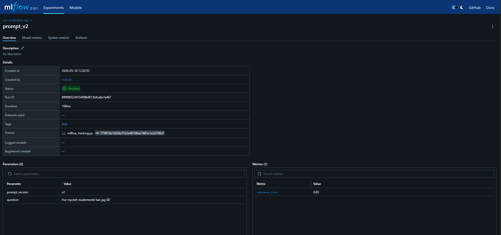
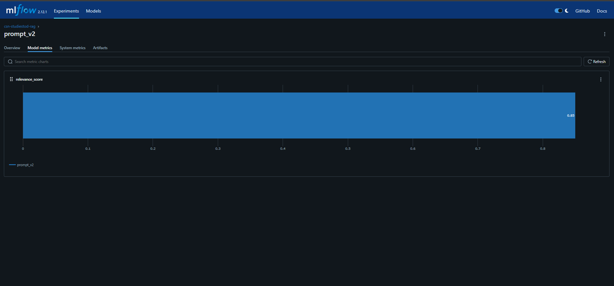
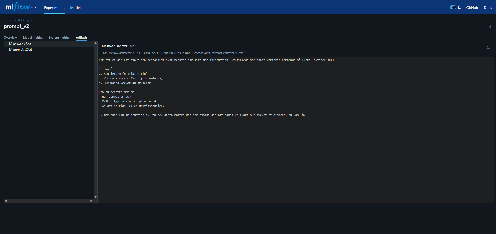

# CSN Chatbot (MLOps project - momh)

## Overview
This project is a chatbot system for CSN-related questions.
Each team member is responsible for a specific domain:

- Studiestöd
- Återbetalning
- Utlandsstudier

The system is built using Retrieval-Augmented Generation (RAG).


## Architecture
The project consists of multiple containerized services:

- Streamlit frontend
- Studiestöd backend
- Återbetalning backend
- Utlandsstudier backend
- MLflow tracking server
- Docker Compose orchestration
- GitHub Actions CI

All backend services are implemented in the `src/momh/backend/` package and are started separately through Docker Compose.


## Project Structure
```text
momh/
├── src/
│   └── momh/
│       └── backend/
│           ├── app/
│           │   ├── studiestod/
│           │   ├── aterbetalning/
│           │   └── utlandsstudier/
│           └── rag/
├── frontend/
│   ├── Dockerfile
│   └── streamlit_app.py
├── backend/
│   └── Dockerfile
├── docker-compose.yml
└── .github/
    └── workflows/
```   
The main backend code is located under `src/momh/backend/`.
The `backend/Dockerfile` is used to build the backend containers.
Each backend service is started separately through `docker-compose.yml`.


## Components

### Backend
Handles:
- RAG pipeline
- API endpoints
- communication with LLM

### Frontend
Handles:
- User interaction
- Sending questions to backend
- Displaying answers

### DevOps
Includes:
- Multi-service Docker setup
- Separate backend and frontend Dockerfiles
- Docker Compose orchestration
- MLflow experiment tracking
- GitHub Actions CI


## Chatbot Domains
Each team member is responsible for a specific CSN domain:

### Studiestöd
See detailed implementation below:
*Implemented by Orhan*

Studiestöd — Orhan Ulusoy

RAG-pipeline för CSN studiestöd (bidrag och lån).

## Vad gör den?
Chatbot som svarar på frågor om CSN:s studiestöd baserat på skrapad data från csn.se.

## Stack
- BeautifulSoup — scraping av csn.se/bidrag-och-lan/
- HuggingFace sentence-transformers — embeddings (multilingual)
- FAISS — vector store
- Claude Sonnet — LLM via Anthropic API
- FastAPI — REST API på port 8001

## Kom igång

1. Installera:
```bash
pip install -r requirements.txt
```

2. Skapa `.env`:

ANTHROPIC_API_KEY=din-nyckel

3. Bygg vector store:
```bash
python rag/pipeline.py
```

4. Starta server:
```bash
python -m uvicorn main:app --reload --port 8001
```

5. Öppna: http://localhost:8001

## MLflow
```bash
python rag/mlflow_tracking.py  # prompt versioning
python rag/evaluation.py       # automatisk evaluering
python -m mlflow ui            # öppna http://localhost:5000
```

## Filstruktur
backend/
├── main.py              # FastAPI app
├── rag/
│   ├── pipeline.py      # scraper + chunker + embeddings
│   ├── retriever.py     # sökning + Claude-anrop
│   ├── evaluation.py    # automatisk svarsutvärdering
│   └── mlflow_tracking.py
└── templates/
└── index.html       # webb-UI

### Återbetalning
See detailed implementation below:
*Implemented by Henke*

# Återbetalning - CSN-Bot

Denna modul hanterar frågor om återbetalning av studielån från CSN.

## Vad den gör

1. Skrapar 10 sidor från csn.se om återbetalning (årsbelopp, ränta, uppskjutning, slutbetalning mm)
2. Delar upp texten i chunks och skapar en vektordatabas med FAISS
3. När en användare ställer en fråga söker den i vektordatabasen efter relevant information
4. Skickar frågan och kontexten till en LLM som genererar ett svar på svenska
5. Returnerar svaret tillsammans med källhänvisningar till vilka CSN-sidor svaret baseras på

## Filer

| Fil | Beskrivning |
|-----|-------------|
| `backend/app/aterbetalning/scraper.py` | Hämtar data från csn.se |
| `backend/app/aterbetalning/embeddings.py` | Chunkar text och skapar FAISS-vektordatabas |
| `backend/app/aterbetalning/rag.py` | RAG-pipeline med OpenRouter |
| `backend/app/aterbetalning/api.py` | FastAPI-endpoint POST /chat på port 8002 |
| `frontend/henke_test.py` | Streamlit-testsida för chatten |
| `backend/data/aterbetalning/` | Scrapad data och vektordatabas |

## Teknik

- **Embeddings:** HuggingFace (sentence-transformers/paraphrase-multilingual-MiniLM-L12-v2)
- **Vektordatabas:** FAISS
- **LLM:** OpenRouter (nvidia/nemotron-3-nano-30b-a3b:free)
- **API:** FastAPI
- **Frontend:** Streamlit

## Köra lokalt

### 1. Installera beroenden

```bash
pip install langchain langchain-community langchain-huggingface langchain-text-splitters faiss-cpu openai python-dotenv fastapi uvicorn streamlit
```

### 2. Skapa .env-fil i projektets rot

```
OPENROUTER_API_KEY=din-nyckel-här
```

API-nyckel skapas gratis på https://openrouter.ai

### 3. Starta backend

```bash
cd backend/app/aterbetalning
python api.py
```

API:t körs på http://localhost:8002

### 4. Testa med Streamlit (valfritt)

```bash
streamlit run frontend/henke_test.py
```

## API

**POST /chat**

Request:
```json
{
  "question": "Hur mycket ska jag betala tillbaka?"
}
```

Response:
```json
{
  "answer": "Ditt årsbelopp beräknas utifrån din inkomst...",
  "sources": ["https://csn.se/fragor-och-svar/..."]
}
```

**GET /health**

Returnerar `{"status": "ok"}`

### Utlandsstudier
To be added. 

Each domain has its own RAG pipeline and backend logic but follows a shared API structure for integration.


## DevOps & Infrastructure
This project uses containerization and CI to ensure a reproducible environment.

### Docker
- Each service runs in its own container
- Frontend and backend services are containerized using separate Dockerfiles
- Docker Compose is used to orchestrate all services together
- MLflow runs as a separate container for experiment tracking

### Docker Compose
- Used to run multiple services together
- Simplifies local development and testing

### CI (GitHub Actions)
- Automatically builds the backend Docker image
- Ensures that the project can run in a clean environment

This setup allows the team to develop independently while maintaining a unified system.


## How to run the project
Make sure Docker is installed and running.

Run the following command:

```bash
docker compose up -d --build
```

Then open in a browser:
- Frontend: http://localhost:8501
- MLflow: http://localhost:5000


## Services
The application is composed of multiple Docker services:

- `frontend` → Streamlit UI (`localhost:8501`)
- `studiestod-backend` → Studiestöd API (`localhost:8001`)
- `aterbetalning-backend` → Återbetalning API (`localhost:8002`)
- `utlandsstudier-backend` → Utlandsstudier API (`localhost:8003`)
- `mlflow` → MLflow tracking UI (`localhost:5000`)


## Screenshots

### Frontend


### Studiestöd chatbot


### Återbetalning chatbot


### Utlandsstudier chatbot


### Docker containers


### MLflow run overview


### MLflow metrics


### MLflow artifacts



## Conclusion
This project demonstrates how independent RAG-based services can be combined into a unified system using DevOps practices.
Each team member works on their own domain while maintaining a shared structure for integration.